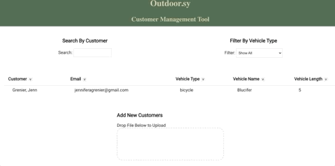
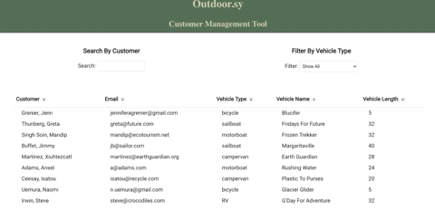

# Outdoor.sy Customer Management Tool - Front End
Ourdoor.sy Customer Management Tool is an application for the mock company Outdoor.sy to list, search, and sort their customers. 
[View Back End Repo](https://github.com/JAGrenier/Outdoor.sy_Back_End)

## Features
### File Upload

 
Users can upload customer data by dragging and dropping at file in the indicated space. The input cusomter information will then render in the customer table. 
 
### Search, Filter, and Sort 
 
 
Users can search customers by typing the cusomter first or last name in the search box. The table can be fitlered to show only customers with a specifcaly vehicle type. The table can also be sorted by any of the table headings.  

## Technologies and Tools
**Front End** React.js

**Back End** Ruby on Rails, PostgreSQL

## How to Open 
1. Clone the code from GitHub on to your Local Machine 
2. With React pre-installed, open the App in your text editor 
3. Run `npm install`
4. Run `npm start` (make sure to NOT be on port 3000)

## Contact
You can find me on [LinkedIn](https://www.linkedin.com/in/jagrenier/)

